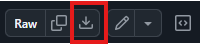

<h1 align="center">Voortijdig Schoolverlaters (VSV) analyse DUO data</h1> 
<div align="center"> <strong>🚀  🛠️</strong>
<br> Een repository voor het inladen en bewerken van DUO data omtrent voortijdig schoolverlaters (VSV). <br> 
<sub> Dit is een eerste aanzet voor het ontsluiten, visualiseren en analyseren van DUO VSV data. </sub> 

</div>


## 📋 Inhoudsopgave

- [Achtergrond en Motivatie](#-achtergrond-en-motivatie)
- [Quick Quick Start](#-quick-quick-start)
- [Quick Start](#-quick-start)
- [Dankwoord](#-dankwoord)
- [Bijdragen en Verbetersuggesties?!](#-bijdragen-en-verbetersuggesties?!)

## 💡 Achtergrond en Motivatie
Een voortijdig schoolverlater (vsv'er) is iemand die jonger is dan 23 jaar en die het onderwijs verlaat zonder het behalen van een startkwalificatie. 
Een startkwalificatie is een havo- of vwo-diploma of een diploma op mbo-2 niveau of hoger.


Het is belangrijk om het aantal VSV'ers vroegtijdig te signaleren en zoveel mogelijk terug te dringe,\n, omdat de vsv'er:

📉 Minder kans heeft op de arbeidsmarkt: zonder diploma is het moeilijker om werk te vinden of door te groeien.

🧠 Persoonlijke ontwikkeling stagneert: school biedt niet alleen kennis, maar ook sociale vaardigheden en structuur.


Daarom is het belangrijk de ontwikkeling van VSV-cijfers in kaart te brengen. 

In dit project worden de DUO data, die benodigd zijn voor het berekenen van het aandeel VSV'ers, 
ingelezen en samengevoegd tot één databestand waarop visulatiestaties gemaakt en analyses uitgevoerd kunnen worden.


## 🚀🚀 Quick Quick Start
1. Download het volgende .bat bestand: https://github.com/cedanl/vsv_analysis/blob/main/install_r_windows_0.1.bat. 
Druk hiervoor op het icoontje rechtsboven:  
2. Plaats het .bat bestand in een map, waar OneDrive niet geactiveerd is.
3. Voer het .bat bestand uit met een dubbelklik op het bestand. Afhankelijk van de geïnstalleerde R-pakketten op je systeem kan dit enkele minuten duren.
4. Als de installatie goed is gegaan, opent R-Studio. Volg vervolgens de instructies in de Console op.


## 🚀 Quick Start

1. Zorg ervoor dat je R (versie 4.0.0 of hoger) en RStudio hebt geïnstalleerd.
2. Klik rechtsboven op "Code" ().
3. Clone deze repository met Git of een Git-client zoals GitHub Desktop of SmartGit, of download het als zip-bestand.
4. Open het project in RStudio en voer het setup-script uit door op Enter te drukken:
```
Setup script detected. Run 00_setup.R? (press ENTER to run, ESC to skip): 
```
5. Afhankelijk van de geïnstalleerde R-pakketten op je systeem kan dit enkele minuten duren.
6. Voer de verkennende analyse uit door instroomprognose_prototype.qmd te openen en op Render te klikken.
7. Bekijk het rapport in HTML- of PDF-formaat.


## 🙏 Dankwoord
- Dank aan Npuls voor het bieden van de mogelijkheid om dit pakket te ontwikkelen.
- Dank aan de CEDA-collega’s voor alle hulp, bijdragen en inspiratie.
- Dank aan degenen die tijd hebben vrijgemaakt om dit project te testen.
- In het bijzonder dank aan Martine, Corneel, Steven, Malong, Tomer en Ash!


## 💡 Bijdragen en Verbetersuggesties?!
Iedereen is welkom om bij te dragen aan dit project: samen weten we meer dan alleen!

<i>Hoe kun je bijdragen?</i>

- 🐞 Meld bugs of stel nieuwe functies voor door een issue aan te maken.
- 🔄 Dien pull requests in voor bugfixes of nieuwe functionaliteiten.
- 🚧 Verbeter de documentatie of voeg gebruiksvoorbeelden toe.


